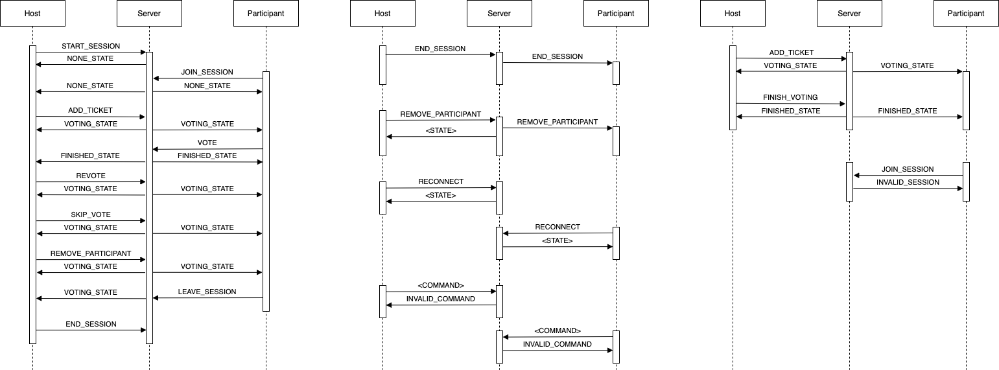

# mamba-backend-vapor

[![Contributors][contributors-shield]][contributors-url]
[![Stargazers][stars-shield]][stars-url]

<br />
<p align="center">
  
</p>

## Table of Contents

* [About the Project](#about-the-project)
  * [Description](#description)
  * [Built With](#built-with)
* [Getting Started](#getting-started)
  * [Prerequisites](#prerequisites)
  * [Installation](#installation)
* [Usage](#usage)
  * [Swift Package Manager](#swift-package-manager)
  * [Docker](#docker)
  * [Commands](#commands)
  * [Error codes](#error-codes)
* [Roadmap](#roadmap)
* [License](#license)
* [Contact](#contact)

## About The Project

### Description

This is the backend companion for [Mamba iOS](https://github.com/Operation-Winter/mamba-ios)

The Mamba project allows a user to host or join a Story Point Planning session and vote on a story.

### Built With

- [Vapor 4.0](https://vapor.codes/)
- [Swift 5.3](https://swift.org/blog/)
- [Swift Package Manager](https://swift.org/package-manager/)
- [Mamba Networking](https://github.com/Operation-Winter/mamba-networking)

## Getting Started

To get a local copy up and running follow these simple example steps.

### Prerequisites

1. XCode 12 Development Tools
2. Install Vapor using brew.
 ```sh
 brew install vapor
 ```

### Installation

1. Clone the repo
```sh
git clone https://github.com/Operation-Winter/mamba-ios.git
```
2. Open in XCode

## Usage

### Swift Package Manager

Build package:
```sh
swift build
```

Test package:
```sh
swift test
```

Update or resolve package dependencies:
```sh
swift package update
```

### Docker

To run the container:
```sh
docker-compose up
```

### Commands

Commands are sent between the backend and any front-end application using WebSockets.
A command is sent in the following structure:
```json
{
    "uuid": "<Front-End UUID>",
    "type": "<Command identifier>",
    "message": { } //Contains the message body structure as specified below or null
}
```

#### Planning Sequence Diagram



---

#### Planning Host

##### Client to server

Type                    | Description                                               | Message
-------------           | ------------                                              | -----------
`START_SESSION`         | Send session name and available cards                     | ```{ "sessionName": "Example session", "availableCards": ["ZERO", "ONE", "TWO", "THREE", "FIVE", "EIGHT", "THIRTEEN", "TWENTY", "FOURTY", "HUNDRED", "QUESTION", "COFFEE"] }```
`ADD_TICKET`            | Add a new ticket. Changes state to `VOTING`               | ```{ "title": "DM-10000", "description": "Blah blah" }```
`SKIP_VOTE`             | Skip vote for a participant                               | ```{ "participantId": "" }```
`END_SESSION`           | Closes session and removes all participants               | None
`REMOVE_PARTICIPANT`    | Request to remove a participant from the session          | ```{ "participantId": "" }```
`FINISH_VOTING`         | Force state from `VOTING` to `VOTING_FINISHED`            | None
`REVOTE`                | When in `VOTING_FINISHED` state revote the current ticket | None
`RECONNECT`             | Reconnect to existing session using a UUID                | None

##### Server to client

Type                    | Description                                                           | Message
-------------           | ------------                                                          | -----------
`NONE_STATE`            | State `NONE` command containing current state of session              | ```{"participants":[{"name":"Armand","participantId":"852ACB12-4B40-4BC2-B72B-17057A1A5AE9"}],"availableCards":["ZERO","ONE","TWO","THREE","FIVE","EIGHT","THIRTEEN","TWENTY","FOURTY","HUNDRED","QUESTION","COFFEE"],"sessionCode":"000000","sessionName":"Test"}```
`VOTING_STATE`          | State `VOTING` command containing current state of session            | ```{"participants":[{"name":"Armand","participantId":"852ACB12-4B40-4BC2-B72B-17057A1A5AE9"},{"name":"Piet","participantId":"34ED510B-B21D-423E-83D0-B85747F4D515"}],"ticket":{"title":"Test","ticketVotes":[{"participantId":"852ACB12-4B40-4BC2-B72B-17057A1A5AE9","selectedCard":"FIVE"}],"description":"Test"},"availableCards":["ZERO","ONE","TWO","THREE","FIVE","EIGHT","THIRTEEN","TWENTY","FOURTY","HUNDRED","QUESTION","COFFEE"],"sessionCode":"000000","sessionName":"Test"}```
`FINISHED_STATE`        | State `VOTING_FINISHED` command containing current state of session   | ```{"participants":[{"name":"Armand","participantId":"852ACB12-4B40-4BC2-B72B-17057A1A5AE9"},{"name":"Piet","participantId":"34ED510B-B21D-423E-83D0-B85747F4D515"}],"ticket":{"title":"Test","ticketVotes":[{"participantId":"852ACB12-4B40-4BC2-B72B-17057A1A5AE9","selectedCard":"FIVE"}],"description":"Test"},"availableCards":["ZERO","ONE","TWO","THREE","FIVE","EIGHT","THIRTEEN","TWENTY","FOURTY","HUNDRED","QUESTION","COFFEE"],"sessionCode":"000000","sessionName":"Test"}```
`INVALID_COMMAND`       | Inform client that command sent is invalid                            | ```{"code":"0000","description":"No session code has been specified"}```

#### Planning Join

##### Client to server

Type                    | Description                                   | Message
-------------           | ------------                                  | ------------
`JOIN_SESSION`          | Send session name and available cards         | ```{"participantName":"Armand","sessionCode":"545544"}```
`VOTE`                  | Send vote value for a ticket                  | ```{"selectedCard":"ONE"}```
`LEAVE_SESSION`         | Inform server client is disconnecting         | None
`RECONNECT`             | Reconnect to existing session using a UUID    | None

##### Server to client

Type                    | Description                                                               | Message
-------------           | ------------                                                              | -----------
`NONE_STATE`            | State `NONE` command containing current state of session                  | ```{"participants":[{"name":"Armand","participantId":"852ACB12-4B40-4BC2-B72B-17057A1A5AE9"}],"availableCards":["ZERO","ONE","TWO","THREE","FIVE","EIGHT","THIRTEEN","TWENTY","FOURTY","HUNDRED","QUESTION","COFFEE"],"sessionCode":"000000","sessionName":"Test"}```
`VOTING_STATE`          | State `VOTING` command containing current state of session                | ```{"participants":[{"name":"Armand","participantId":"852ACB12-4B40-4BC2-B72B-17057A1A5AE9"},{"name":"Piet","participantId":"34ED510B-B21D-423E-83D0-B85747F4D515"}],"ticket":{"title":"Test","ticketVotes":[{"participantId":"852ACB12-4B40-4BC2-B72B-17057A1A5AE9","selectedCard":"FIVE"}],"description":"Test"},"availableCards":["ZERO","ONE","TWO","THREE","FIVE","EIGHT","THIRTEEN","TWENTY","FOURTY","HUNDRED","QUESTION","COFFEE"],"sessionCode":"000000","sessionName":"Test"}```
`FINISHED_STATE`        | State `VOTING_FINISHED` command containing current state of session       | ```{"participants":[{"name":"Armand","participantId":"852ACB12-4B40-4BC2-B72B-17057A1A5AE9"},{"name":"Piet","participantId":"34ED510B-B21D-423E-83D0-B85747F4D515"}],"ticket":{"title":"Test","ticketVotes":[{"participantId":"852ACB12-4B40-4BC2-B72B-17057A1A5AE9","selectedCard":"FIVE"}],"description":"Test"},"availableCards":["ZERO","ONE","TWO","THREE","FIVE","EIGHT","THIRTEEN","TWENTY","FOURTY","HUNDRED","QUESTION","COFFEE"],"sessionCode":"000000","sessionName":"Test"}```
`INVALID_COMMAND`       | Inform client that command sent is invalid                                | ```{"code":"0000","description":"No session code has been specified"}```
`INVALID_SESSION`       | Inform client that session is invalid                                     | None
`REMOVE_PARTICIPANT`    | Inform client that it has been removed                                    | None
`END_SESSION`           | Inform client that session had been ended                                 | None

### Error codes

#### Invalid Session

- `0001`: The specified session code doesn't exist or is no longer available.

#### Invalid Command

- `0000`: No session code has been specified.
- `1000`: Session is not available anymore.

- `0000`: No session code has been specified.
- `0002`: The command doesn't exist.
- `0003`: The server has run out of capacity, could not create a new planning session.
- `0004`: Invalid identifier.
- `0005`: Invalid parameters.

## Roadmap

White lines indicate completed features.

[![Roadmap][roadmap]](Docs/Roadmap.png)

## License

Distributed under the MIT License. See `LICENSE` for more information.

## Contact

Armand Kamffer - [@Armgame](https://twitter.com/Armgame) - kamffer1@gmail.com

[contributors-shield]: https://img.shields.io/github/contributors/Operation-Winter/mamba-backend-vapor?style=flat-square
[contributors-url]: https://github.com/Operation-Winter/mamba-backend-vapor/graphs/contributors

[stars-shield]: https://img.shields.io/github/stars/Operation-Winter/mamba-backend-vapor?style=flat-square?style=flat-square
[stars-url]: https://github.com/Operation-Winter/mamba-backend-vapor/stargazers

[roadmap]: Docs/Roadmap.png